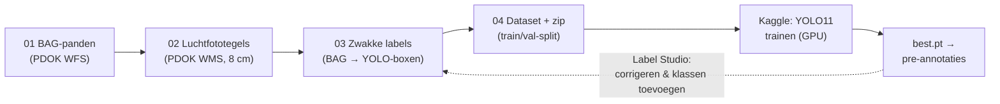

# ObjectDetectie — dakobjecten herkennen op Nederlandse luchtfoto's

Pipeline om trainingsdata te genereren uit **open Nederlandse geodata** (PDOK-luchtfoto's + BAG)
en daar op **Kaggle** een objectdetectiemodel (YOLO11) mee te trainen. Doel: onderdelen van
panden signaleren op luchtfoto's — zonnepanelen, dakkapellen, aanbouwen, bijgebouwen, zwembaden —
als **signalering voor een taxateur**, niet als geautomatiseerde beslisser.



## Snel starten (Windows, VS Code)

Draai de genummerde stappen in volgorde — dat is de hele werkcyclus:

```powershell
.\stappen\1-voorbereiden.ps1            # git pull + venv + data + annotatieronde klaarzetten
.\stappen\2-labelen.ps1                 # Label Studio starten en annoteren
.\stappen\3-annotaties-importeren.ps1   # nieuwste export uit Downloads terugzetten
.\stappen\4-trainen.ps1                 # uploaden, trainen op Kaggle, model klaarzetten
```

Stap 4 wacht op de training en zet het model met versienummer in `data\models\`
(los ophalen kan met `.\stappen\5-model-ophalen.ps1`). Daarna begint de cyclus
opnieuw bij stap 1 — die pre-annoteert dan automatisch met je nieuwste model.
Alles is veilig om te herhalen: gedane stappen melden zich en worden overgeslagen,
en handmatige annotaties worden nooit overschreven.

De stappen zijn dunne schillen om `start.ps1` en de losse Python-scripts,
die je ook altijd zelf kunt aanroepen:

```powershell
py -m venv .venv
.venv\Scripts\Activate.ps1
pip install -r requirements.txt

python scripts\01_fetch_bag.py        # BAG-pandcontouren binnen het gebied
python scripts\02_download_tiles.py   # luchtfototegels (herstartbaar; --max-tegels 25 om te proeven)
python scripts\03_make_labels.py      # YOLO-labels uit de BAG-contouren
python scripts\05_preview.py          # controle: boxen over de foto's getekend
python scripts\04_build_dataset.py    # dataset + zip voor Kaggle
```

(Op macOS/Linux: `python3 -m venv .venv && source .venv/bin/activate`, verder identiek.)

Alles is instelbaar in [config.yaml](config.yaml): het gebied (RD-bbox), resolutie,
tegelgrootte, klassen en train/val-verhouding. Begin klein; het standaardgebied is
1,5 × 1,5 km woonwijk in Etten-Leur (~900 tegels, ~50 MB).

## Trainen op de devbox (zonder Kaggle)

De Kaggle-notebooks zijn dunne schillen om dezelfde scripts; lokaal trainen kan ook:

```powershell
pip install -r requirements-train.txt   # eenmalig; heeft je machine een NVIDIA-GPU,
                                        # installeer dan eerst torch met CUDA (zie pytorch.org)
python scripts\08_train.py              # traint op data\dataset\<naam>, gewichten in data\runs\
```

Check met `nvidia-smi` of er een GPU is. Zonder GPU: prima voor proefrondes
(`--model yolo11n.pt --epochs 30`), maar voor serieuze trainingen is Kaggle's
gratis GPU sneller. Zelfde dataset, zelfde recept — je kunt vrij wisselen.

## Naar Kaggle: twee routes

**Route A — lokaal genereren, zip uploaden**

1. Eenmalig: `pip install kaggle` en een API-token via kaggle.com → *Settings → Create New Token*;
   zet het gedownloade `kaggle.json` in `C:\Users\<jij>\.kaggle\` (nooit in deze repo).
2. `python scripts\04_build_dataset.py` print de exacte uploadcommando's
   (`kaggle datasets create -p data\kaggle_upload\...`).

**Route B — alles óp Kaggle genereren** (geen upload vanaf je eigen machine nodig)

1. Push deze repo naar GitHub.
2. Maak op Kaggle een notebook van
   [notebooks/kaggle_generate_dataset.ipynb](notebooks/kaggle_generate_dataset.ipynb),
   zet *Settings → Internet* op **On** (CPU volstaat) en vul bovenin de repo-URL in
   (privérepo: secret `GITHUB_TOKEN` via *Add-ons → Secrets*).
3. *Save Version → Save & Run All* — de dataset verschijnt als notebook-output.

**Trainen** (beide routes)

1. Maak op Kaggle een notebook van [notebooks/kaggle_train_yolo.ipynb](notebooks/kaggle_train_yolo.ipynb),
   koppel via *Add Input* je dataset (route A) of de notebook-output (route B),
   en zet een GPU-accelerator aan.
2. Download na de training `best.pt` via het *Output*-tabblad.

**Trainen vanaf de terminal** (zonder browser)

Eenmalig: vul in [notebooks/kernel-metadata.json](notebooks/kernel-metadata.json) tweemaal je
Kaggle-gebruikersnaam in; controleer de dataset-slug met `kaggle datasets list -m`. Daarna:

```powershell
kaggle kernels push -p notebooks                                  # uploadt én start de training
kaggle kernels status GEBRUIKERSNAAM/bwb-daken-training           # tot "complete"
kaggle kernels output GEBRUIKERSNAAM/bwb-daken-training -p data\kaggle_output
Copy-Item data\kaggle_output\runs\bwb_daken\weights\best.pt data\models\bwb_daken_vX.pt
```

Elke push start een verse run (en verbruikt dus GPU-quotum); de run pakt automatisch
de nieuwste versie van de gekoppelde dataset.

## Van 'pand' naar de echte klassen (Label Studio)

De pipeline labelt automatisch de klassen **pand** en **schuur_bijgebouw** (uit de BAG:
een pand zonder verblijfsobject is vrijwel altijd een bijgebouw). De overige klassen
annoteer je in [Label Studio](https://labelstud.io/) (self-hosted, dus BIO-vriendelijk);
reken op **~300 voorbeelden per klasse** voor een bruikbare v1 — of geef jezelf een
voorsprong met een externe dataset (zie hieronder). De lus:

1. **Exporteren**: `python scripts\06_export_labelstudio.py` maakt `data\labelstudio\tasks.json`
   (met de zwakke pand-labels als pre-annotatie) en `labeling_config.xml` — de interface met
   exact de klassen uit `config.yaml`. Gebruik `--aantal 100` voor een behapbare annotatieronde.
2. **Label Studio starten**: `.\start.ps1 -Labelen` — installeert Label Studio zo nodig en
   start hem met lokale bestandsserving (document-root `data\tiles`) zodat de tegels
   zichtbaar zijn. Handmatig kan ook: zet `LABEL_STUDIO_LOCAL_FILES_SERVING_ENABLED=true`
   en `LABEL_STUDIO_LOCAL_FILES_DOCUMENT_ROOT=<repo>\data\tiles` en draai `label-studio start`.
3. **Project inrichten**: nieuw project → *Settings → Labeling Interface → Code* → plak de
   inhoud van `labeling_config.xml`. Dan *Settings → Cloud Storage → Add Source Storage →
   Local files*, absoluut pad naar `data\tiles\images` (niet synchroniseren). Importeer
   daarna `tasks.json` via de *Import*-knop.
4. **Annoteren**: corrigeer de pand-boxen waar nodig en teken de nieuwe klassen erbij.
5. **Terugzetten**: exporteer als **JSON** en draai
   `python scripts\07_import_labelstudio.py pad\naar\export.json` — geannoteerde tegels
   vervangen hun zwakke labels, de rest blijft staan. Daarna stap 04 en opnieuw trainen.

Vanaf trainingsronde 2 kan het model zelf pre-annoteren, dan is annoteren vooral corrigeren.
Tip: taxatiedossiers waarin zonnepanelen of een aanbouw al gevalideerd zijn, zijn gratis
positieve voorbeelden — begin met die adressen.

## Externe datasets meebakken (minder zelf annoteren)

Voor zonnepanelen en zwembaden bestaan publieke, al geannoteerde datasets — het snelst
vind je ze op [Roboflow Universe](https://universe.roboflow.com/) (zoek "solar panel aerial",
download in **YOLO-formaat**). Voor dakopbouwen (dakkapel/dakraam/schoorsteen) is de
RID-dataset van de TU München het kijken waard. Meebakken gaat zo:

```powershell
python scripts\09_externe_dataset.py C:\pad\naar\uitgepakte_dataset --map "solar-panel=zonnepanelen"
python scripts\04_build_dataset.py
```

Het script toont de externe klassenamen, hernummert alles naar onze indeling en zet het
resultaat in `data\extern\`. Stap 04 voegt externe beelden **alleen aan train** toe;
de val-split blijft puur Nederlandse tegels zodat de metrics je echte doel meten.
Let op de licentie per dataset (sommige zijn research-only) en verwacht een domeinverschil
(andere resolutie/land) — de winst zit in pre-annotatie: het model dat hierop traint tekent
jouw tegels voor, waardoor annoteren corrigeren wordt.

## Roadmap-ideeën

- **Mutatiedetectie** (zonnepanelen geplaatst, dakkapel gebouwd, verbouwing gestart):
  uitgewerkt plan in [docs/mutatiedetectie.md](docs/mutatiedetectie.md) — PDOK levert
  alle jaargangen op ons vaste tegelgrid, dus voor/na-paren zijn gratis.

- **Aanbouw-kandidaten**: verschil tussen BAG-contour en AHN-hoogtemasker (of 3DBAG LoD2.2-dakvlakken).
- **CIR-luchtfoto** (infrarood, ook op PDOK) om dakvlak van vegetatie te scheiden.
- **Overlap** in `config.yaml` op 0.25 zetten zodat panden op tegelranden vaker volledig in beeld zijn.
- Gevelelementen (erkers e.d.) vragen schuinluchtfoto's of streetview — geen open data;
  check of BWB een Cyclomedia-contract heeft.

## Juridisch & bronvermelding

- Detectie die WOZ-waarden of controles beïnvloedt raakt **art. 22 AVG** (geautomatiseerde
  besluitvorming): ontwerp het model als *signalering voor een taxateur*, plan een
  **IAMA/DPIA** en opname in het **Algoritmeregister** vóór productie.
- PDOK-luchtfoto's zijn **CC-BY 4.0**: bronvermelding is verplicht, ook in afgeleide datasets
  en op Kaggle. Gebruik: *"Bevat gegevens van PDOK: Luchtfoto Beeldmateriaal Nederland
  (CC-BY 4.0) en de Basisregistratie Adressen en Gebouwen (BAG)."*

## Mappenstructuur

```
config.yaml               instellingen (gebied, klassen, resolutie, splits)
start.ps1                 motor: -Labelen / -Trainen / standaard klaarzetten
stappen/                  genummerde werkcyclus (1 t/m 5), zie Snel starten
scripts/
  01_fetch_bag.py         BAG-pandcontouren ophalen (PDOK WFS)
  02_download_tiles.py    luchtfototegels downloaden (PDOK WMS, herstartbaar)
  03_make_labels.py       BAG-contouren -> YOLO-boxen per tegel
  04_build_dataset.py     train/val-split (ruimtelijk), data.yaml, zip voor Kaggle
  05_preview.py           labels over de foto's tekenen ter controle
  06_export_labelstudio.py  tegels + pre-annotaties naar Label Studio
  07_import_labelstudio.py  Label Studio-export terug naar YOLO-labels
  08_train.py             lokaal trainen (zelfde recept als het Kaggle-notebook)
  09_externe_dataset.py   externe YOLO-dataset hernummeren naar onze klassen
notebooks/
  kaggle_generate_dataset.ipynb  dataset genereren óp Kaggle (internet aan, CPU)
  kaggle_train_yolo.ipynb        YOLO11-training op Kaggle (GPU)
data/                     gegenereerde data (niet in git)
```
