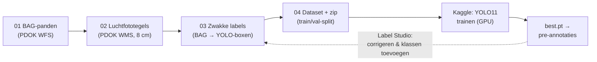

# ObjectDetectie — dakobjecten herkennen op Nederlandse luchtfoto's

Pipeline om trainingsdata te genereren uit **open Nederlandse geodata** (PDOK-luchtfoto's + BAG)
en daar op **Kaggle** een objectdetectiemodel (YOLO11) mee te trainen. Doel: onderdelen van
panden signaleren op luchtfoto's — zonnepanelen, dakkapellen, aanbouwen, bijgebouwen, zwembaden —
als **signalering voor een taxateur**, niet als geautomatiseerde beslisser.



## Snel starten (Windows, VS Code)

```powershell
py -m venv .venv
.venv\Scripts\activate
pip install -r requirements.txt

python scripts\01_fetch_bag.py        # BAG-pandcontouren binnen het gebied
python scripts\02_download_tiles.py   # luchtfototegels (herstartbaar; --max-tegels 25 om te proeven)
python scripts\03_make_labels.py      # YOLO-labels uit de BAG-contouren
python scripts\05_preview.py          # controle: boxen over de foto's getekend
python scripts\04_build_dataset.py    # dataset + zip voor Kaggle
```

(Op macOS/Linux: `python3 -m venv .venv && source .venv/bin/activate`, verder identiek.)

Alles is instelbaar in [config.yaml](config.yaml): het gebied (RD-bbox), resolutie,
tegelgrootte, klassen en train/val-verhouding. Begin klein; het standaardgebied is
1,5 × 1,5 km woonwijk in Etten-Leur (~900 tegels, ~50 MB).

## Naar Kaggle: twee routes

**Route A — lokaal genereren, zip uploaden**

1. Eenmalig: `pip install kaggle` en een API-token via kaggle.com → *Settings → Create New Token*;
   zet het gedownloade `kaggle.json` in `C:\Users\<jij>\.kaggle\` (nooit in deze repo).
2. `python scripts\04_build_dataset.py` print de exacte uploadcommando's
   (`kaggle datasets create -p data\kaggle_upload\...`).

**Route B — alles óp Kaggle genereren** (geen upload vanaf je eigen machine nodig)

1. Push deze repo naar GitHub.
2. Maak op Kaggle een notebook van
   [notebooks/kaggle_generate_dataset.ipynb](notebooks/kaggle_generate_dataset.ipynb),
   zet *Settings → Internet* op **On** (CPU volstaat) en vul bovenin de repo-URL in
   (privérepo: secret `GITHUB_TOKEN` via *Add-ons → Secrets*).
3. *Save Version → Save & Run All* — de dataset verschijnt als notebook-output.

**Trainen** (beide routes)

1. Maak op Kaggle een notebook van [notebooks/kaggle_train_yolo.ipynb](notebooks/kaggle_train_yolo.ipynb),
   koppel via *Add Input* je dataset (route A) of de notebook-output (route B),
   en zet een GPU-accelerator aan.
2. Download na de training `best.pt` via het *Output*-tabblad.

## Van 'pand' naar de echte klassen

De pipeline labelt automatisch alleen de klasse **pand** (uit de BAG). Dat is bewust:
zo valideer je de hele keten end-to-end met gratis, foutloze labels. Daarna:

1. **Pre-annoteren** — laat het getrainde pand-model (of SAM) voorspellingen doen op nieuwe tegels.
2. **Corrigeren in [Label Studio](https://labelstud.io/)** (self-hosted, dus BIO-vriendelijk) —
   YOLO-labels zijn direct importeerbaar via `label-studio-converter`. Gebruik exact de
   klassenlijst en -volgorde uit `config.yaml` (`dataset.klassen`); reken op **~300
   gecorrigeerde voorbeelden per klasse** voor een bruikbare v1.
3. Zet de geëxporteerde YOLO-labels in `data/tiles/labels/` en draai stap 04 opnieuw.

Tip: taxatiedossiers waarin zonnepanelen of een aanbouw al gevalideerd zijn, zijn gratis
positieve voorbeelden — begin met die adressen.

## Roadmap-ideeën

- **Aanbouw-kandidaten**: verschil tussen BAG-contour en AHN-hoogtemasker (of 3DBAG LoD2.2-dakvlakken).
- **CIR-luchtfoto** (infrarood, ook op PDOK) om dakvlak van vegetatie te scheiden.
- **Overlap** in `config.yaml` op 0.25 zetten zodat panden op tegelranden vaker volledig in beeld zijn.
- Gevelelementen (erkers e.d.) vragen schuinluchtfoto's of streetview — geen open data;
  check of BWB een Cyclomedia-contract heeft.

## Juridisch & bronvermelding

- Detectie die WOZ-waarden of controles beïnvloedt raakt **art. 22 AVG** (geautomatiseerde
  besluitvorming): ontwerp het model als *signalering voor een taxateur*, plan een
  **IAMA/DPIA** en opname in het **Algoritmeregister** vóór productie.
- PDOK-luchtfoto's zijn **CC-BY 4.0**: bronvermelding is verplicht, ook in afgeleide datasets
  en op Kaggle. Gebruik: *"Bevat gegevens van PDOK: Luchtfoto Beeldmateriaal Nederland
  (CC-BY 4.0) en de Basisregistratie Adressen en Gebouwen (BAG)."*

## Mappenstructuur

```
config.yaml               instellingen (gebied, klassen, resolutie, splits)
scripts/
  01_fetch_bag.py         BAG-pandcontouren ophalen (PDOK WFS)
  02_download_tiles.py    luchtfototegels downloaden (PDOK WMS, herstartbaar)
  03_make_labels.py       BAG-contouren -> YOLO-boxen per tegel
  04_build_dataset.py     train/val-split (ruimtelijk), data.yaml, zip voor Kaggle
  05_preview.py           labels over de foto's tekenen ter controle
notebooks/
  kaggle_generate_dataset.ipynb  dataset genereren óp Kaggle (internet aan, CPU)
  kaggle_train_yolo.ipynb        YOLO11-training op Kaggle (GPU)
data/                     gegenereerde data (niet in git)
```
